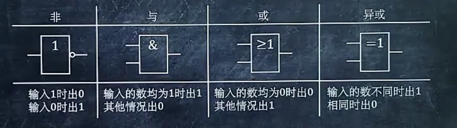
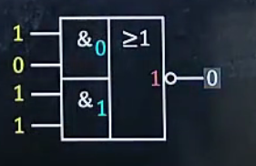
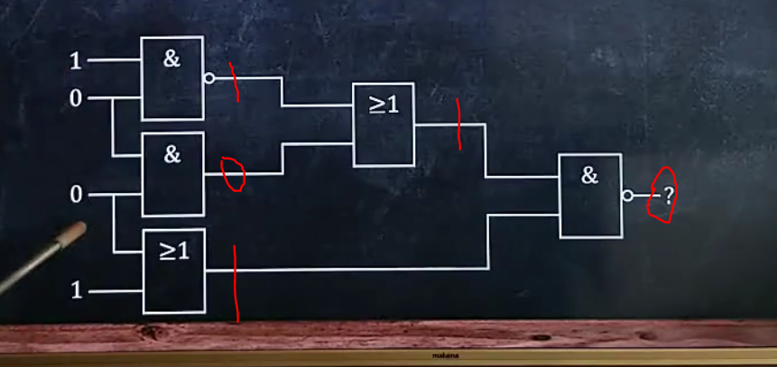
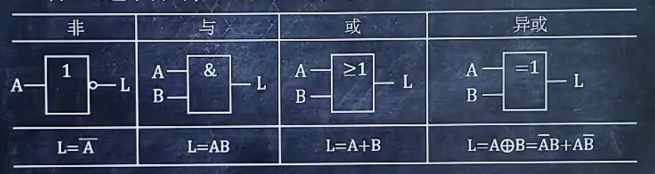
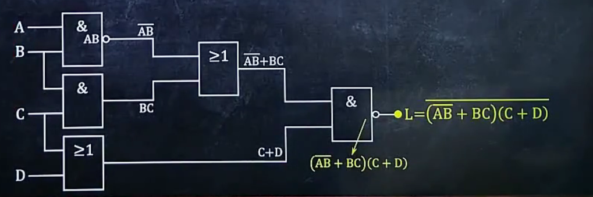
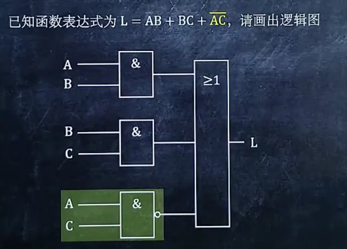
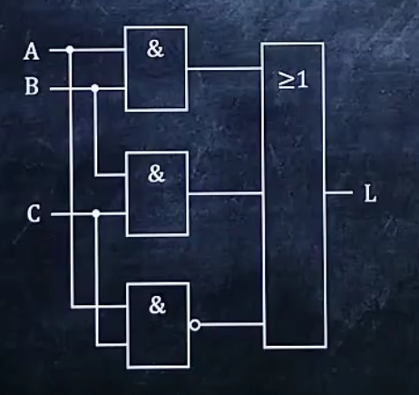

# 基础知识

非门：给1出0，给0出1  **特点：有个圈**

与门：input**都是**1时才出1

或门:   input**只要**有一个1就出1

异或门:input给的俩不一样时出1

## eg1:

先做两个与运算，再做一个或运算，最后做一个非运算

如果为门为空则代表与它平行的逻辑门相同

##eg2：

# 给逻辑图，写表达式

## 基础：

 

# 给表达式，画逻辑图

第一步：先把外层结构画出来（最外层的或结构）

第二步:把相同的线都连一块(看图)

