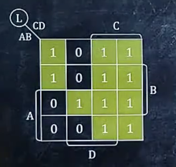
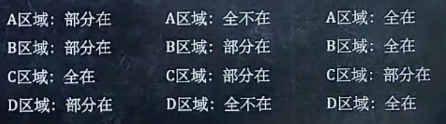
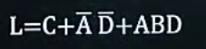
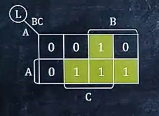
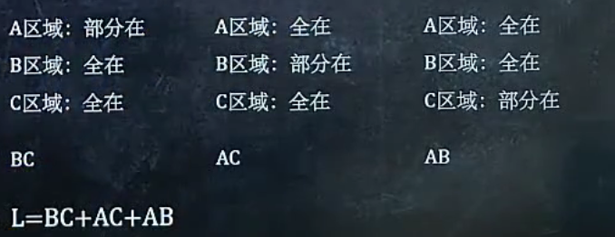
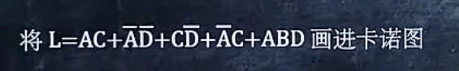
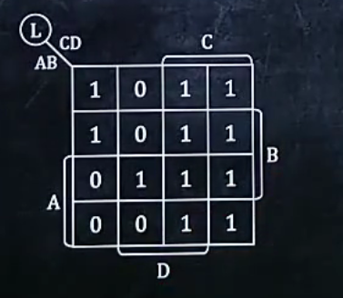

 # 卡诺图化逻辑表达式

第一步：圈出来**相邻的**（PS:卡诺图中是边界联通的）8个1，圈不出8个圈4个，以此类推

第二步:   判断圈出来的8个1，圈出来的四个1，以及圈出来的剩下的1是否在A,B,C,D区域中

eg:

第三步:部分在的不用管，全在的照抄，全不在加“非”，每一部分都用逻辑与连起来，整体用逻辑或连接

*最终结果*：

##eg:

# 将逻辑表达式画入卡诺图

第一步:根据变量个数判断规格

第二步:划分ABCD四个区域（假如说是4x4）		2x4

- A区域：最下面两行						A区域：最下面一行
- B区域：中间两行                                                  B区域：最右边两列
- C区域：最右边两列                                              C区域：中间两列
- D区域：中间两列

第三步：每一项的区域取交集，在格子里填1

*结果*：

# 利用卡诺图化简逻辑表达式

第一步：先把逻辑表达式化成卡诺图

第二步：再把卡诺图表示成表达式（见上）

#利用卡诺图求反函数
讲原函数画成卡诺图，然后在把卡诺图中的01互换,最后表示成反函数
