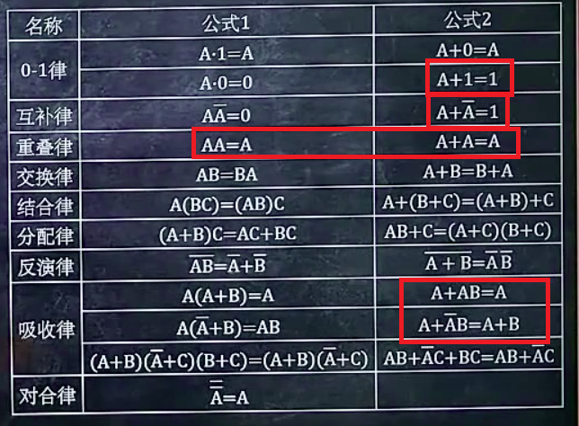

#公式法化简逻辑表达式

真正用的频繁的只有画圈的那几个

##吸收法

 

此时可以将B看作是多余的乘积项

上述例子中画框的部分都可以看做是B然后消掉

## 消去法

 

此时**A非**可以看做是多余因子

## 配项法

利用表格中的重叠率

**建议练习题**：P22页1-14

PS：这块硬背是没卵用的，还是找几个题写写心里比较踏实

#逻辑代数的三条规则
##代入规则
多变量可以等价代替原式中某一单变量
作用:可将两个变量的等式变为三个变量的等式（狭义）
##反演规则
也就是所谓的求反函数的规则，见下
##对偶规则
上述表格中的公式1和公式2都可以用这条规则互推
具体规则：互换一个逻辑式中的“与或01”，则新逻辑式依然成立

#求一个逻辑式的反函数
第一步：先把每一个元素拆碎（这个过程中不用管两个以上的长横线，只管拆）
第二步:（其实也可以在第一步完成）互换与或01
第三步: 每个元素都取个反，顺便整理下格式，顺手把长横线补上
（PS：很简单的，找12页最底下的那道题练练就ok）
