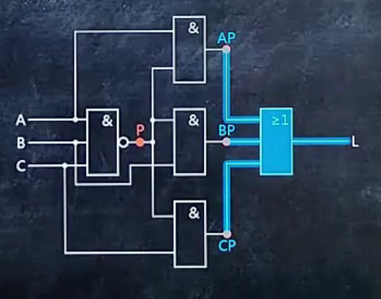
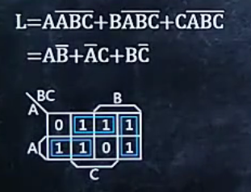
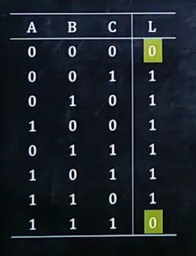
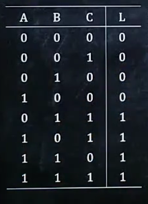

# 给出逻辑电路图，分析逻辑功能

 

第一步:根据电路图写出逻辑式，并化简

*化简结果*：

第二步：将布尔值代入并列出所有情况

第三步：分析电路功能

 ## 常见逻辑功能

不一致电路：A,B,C不一致输出为1

一致电路：    A,B,C相同时输出1

少数服从多数电路:0多取0,1多取1 

# 给出功能要求，设计电路

第一步:根据要求列出上表

*PS:题目要求是少数服从多数*

第二步:根据布尔值为真的项写出逻辑表达式

第三步:化简并画出电路图