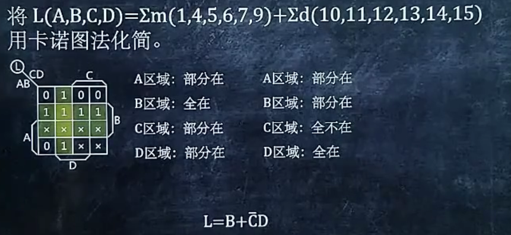

# 用卡诺图将逻辑式变成最小项

第一步:将逻辑式化成卡诺图

第二步:将卡诺图与下图做对比，和1重叠的部分既是最小项

 

这个图的记忆方法:先把0-15从左上填到右下，然后把最下面两行颠倒一下，再把最右边两列颠倒一下

# 用公式法将逻辑式化为最小项

*EG:*

第一步:判断逻辑式的元素个数，然后将每个项的元素个数都补全，顺手整理下ABC的顺序

第二步:填01 (看图吧)：

*接下来的操作就和之前在离散数学中学的差不多了*

# 将最小项化为逻辑式

就是上一步的逆操作，简单的一批

# 

第一步:先把之前的那个图画出来

第二步:根据上图，在m(最小项)的格子里填1（建议再画一个格子）,在d对应的格子画x，剩下的填0

第三步:将第二步画出的卡诺图化简(优先化1，x可看做1也可看做0)

